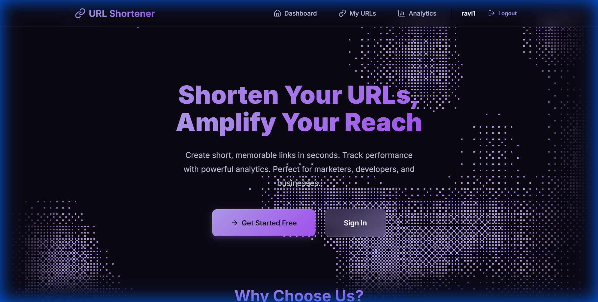
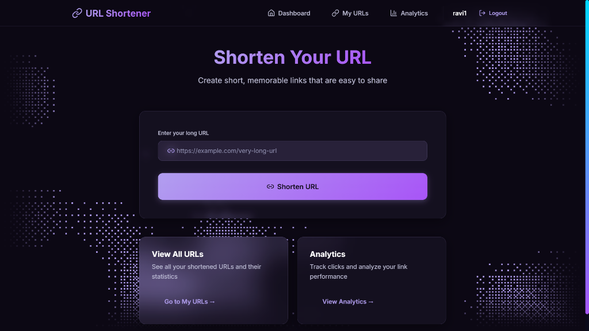
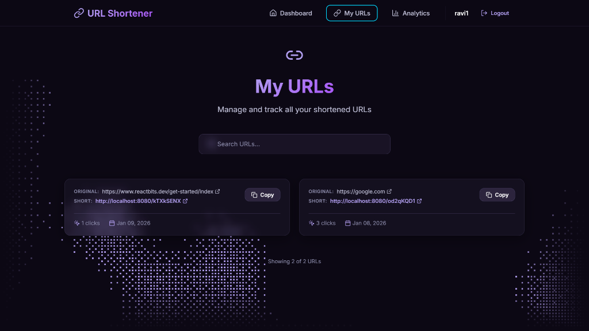
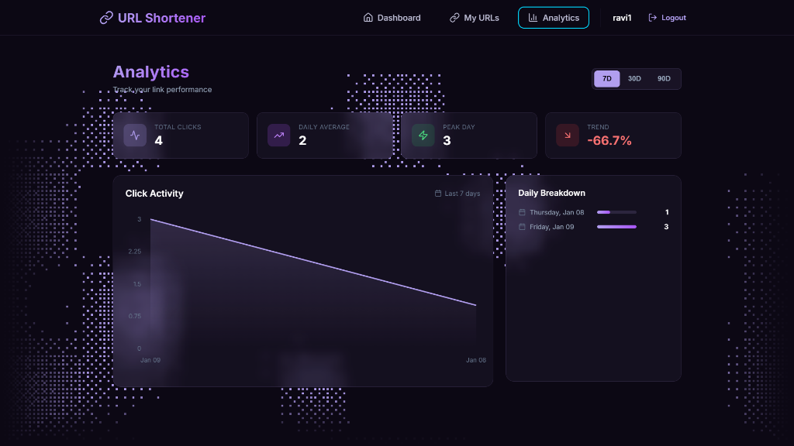

# URL Shortener

A modern, full-stack URL shortening application with analytics dashboard built with **Spring Boot** and **React**.

## Features

- 🔗 **URL Shortening** - Create short, memorable links instantly
- 📊 **Analytics Dashboard** - Track clicks, view trends, and analyze link performance
- 🔐 **JWT Authentication** - Secure user registration and login
- 🎨 **Modern UI** - Lavender-themed design with interactive PixelBlast background
- 📱 **Responsive** - Works seamlessly on desktop and mobile

## Screenshots

<div align="center">
  
  <p><em>Landing Page</em></p>
</div>

&nbsp;

<div align="center">
  
  <p><em>Registration Page</em></p>
</div>

&nbsp;

<div align="center">
  
  <p><em>Dashboard</em></p>
</div>

&nbsp;

<div align="center">
  
  <p><em>My URLs Management</em></p>
</div>

&nbsp;

<div align="center">
  
  <p><em>Analytics Dashboard</em></p>
</div>

## Tech Stack

### Backend
- **Java 17+** with **Spring Boot 3**
- **Spring Security** with JWT authentication
- **Spring Data JPA** with MySQL/PostgreSQL
- **Maven** for dependency management

### Frontend
- **React 18** with **TypeScript**
- **Vite** for fast development and building
- **React Router** for navigation
- **Axios** for API calls
- **Recharts** for analytics visualization
- **Framer Motion** for animations
- **Three.js** for PixelBlast background effects

## Getting Started

### Prerequisites
- Java 17 or higher
- Node.js 18 or higher
- MySQL or PostgreSQL database

### Backend Setup

1. Clone the repository:
   ```bash
   git clone https://github.com/Ravi7141/Url-shortener-sb.git
   cd Url-shortener-sb
   ```

2. Configure database in `src/main/resources/application.properties`:
   ```properties
   spring.datasource.url=jdbc:mysql://localhost:3306/urlshortener
   spring.datasource.username=your_username
   spring.datasource.password=your_password
   ```

3. Run the backend:
   ```bash
   ./mvnw spring-boot:run
   ```
   Backend runs on `http://localhost:8080`

### Frontend Setup

1. Navigate to frontend directory:
   ```bash
   cd frontend
   ```

2. Install dependencies:
   ```bash
   npm install
   ```

3. Create `.env` file (optional):
   ```env
   VITE_API_BASE_URL=http://localhost:8080
   ```

4. Run the development server:
   ```bash
   npm run dev
   ```
   Frontend runs on `http://localhost:5173`

## API Endpoints

### Authentication
- `POST /api/auth/register` - Register new user
- `POST /api/auth/login` - User login

### URL Operations
- `POST /api/urls/shorten` - Create short URL
- `GET /api/urls/my-urls` - Get user's URLs
- `GET /{shortCode}` - Redirect to original URL

### Analytics
- `GET /api/urls/{shortCode}/clicks` - Get click analytics

## Project Structure

```
Url-shortener-sb/
├── src/main/java/com/url/shortener/
│   ├── controller/          # REST controllers
│   ├── service/              # Business logic
│   ├── repository/           # Data access
│   ├── model/                # Entity classes
│   └── security/             # JWT configuration
├── frontend/
│   ├── src/
│   │   ├── components/       # React components
│   │   ├── pages/            # Page components
│   │   ├── services/         # API services
│   │   └── contexts/         # React contexts
│   └── package.json
└── pom.xml
```

## Contributing

1. Fork the repository
2. Create your feature branch (`git checkout -b feature/amazing-feature`)
3. Commit your changes (`git commit -m 'Add amazing feature'`)
4. Push to the branch (`git push origin feature/amazing-feature`)
5. Open a Pull Request

## Author

**Ravi Rajput** - [GitHub](https://github.com/Ravi7141)
